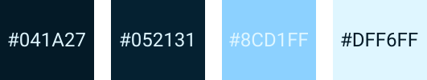

<h1 align="center">Portfólio - Diovane Alves</h1>

Esse Site serve para mostrar o meu currículo pessoal. Aonde exibe minha Historia, Projetos e Informações para Contato.

| :placard: Vitrine.Dev |                                           |
| --------------------- | ----------------------------------------- |
| :sparkles: Nome       | **Portfolio**                             |
| :label: Tecnologias   | React, TailwindCSS                        |
| :rocket: URL          | https://diovanealves.github.io/Portfolio/ |
| :fire: Repositorio    | https://github.com/diovanealves/Portfolio |

    

<h2 align="center">Melhorias</h2>

- [x] Responsividade em dispositivos Mobile.
- [x] Animação ao rolar a página.
- [ ] Projetos vindo do Back-End.
- [x] Personalização da Scroll Bar.

<h2 align="center">Autor</h2>
<table>
  <tr>
    <td>
        
            <a href="https://github.com/diovanealves" style="color:#8e2424" align="center">
                
Github

            </a>
            <a href="https://www.linkedin.com/in/diovane-alves-de-oliveira-5320a0217/" style="color:#8e2424" align="center">
                
Linkedin

            </a>
            <a href="https://twitter.com/deluxyfps" style="color:#8e2424" align="center">
                
Twitter

            </a>
    </td>
  </tr>
</table>
